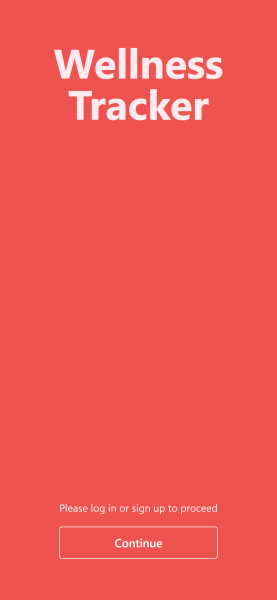
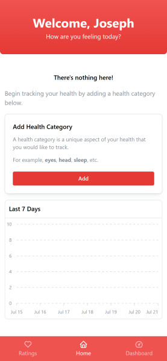
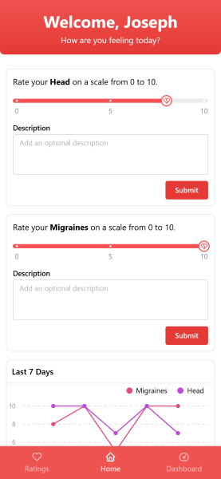
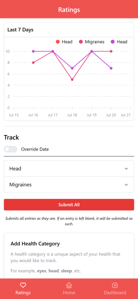
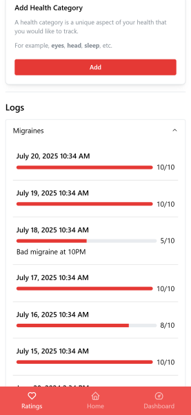

# Wellness Tracker
A simple PWA to rate, record, and track your personal wellness. Gain insights into your well-being and identify trends over time.
  
Users can track custom wellness categories by leaving comments and ratings, allowing them to monitor their progress through detailed logs and insightful data visualizations.  
  

## Development
### Components

The application is built using a modern stack to ensure performance, scalability, and a stable user experience:

+ React.js: The core frontend and client code of the application, used for building a dynamic and responsive user interface.

+ Auth0: Provides robust user authentication for secure and streamlined user logins.

+ AWS Lambda Functions: Handles serverless API routing, allowing for efficient backend logic and API requests without the overhead of managing servers.

+ AWS DynamoDB: A scalable and fast NoSQL database solution, leveraging global secondary indexes for quick retrieval of user data.

+ Docker: An additional, optional layer for building and deployment of the application.

### Getting Started (Local Development)
To get the Wellness Tracker up and running on your local machine, follow these steps:

1.  **Clone the Repository:**
    ```bash
    git clone https://github.com/josephoneill/wellness-tracker.git
    cd wellness-tracker
    ```

2.  **Install Dependencies:**
    Navigate to the project directory and install the required Node.js dependencies:
    ```bash
    yarn install
    ```

3.  **Configure Environment Variables:**
    The application relies on several environment variables for AWS and Auth0 configuration. Create a `.env` file in the root of your project directory and populate it with the following:

    ```env
    VITE_AWS_ACCESS_KEY=your_aws_access_key
    VITE_AWS_SECRET_KEY=your_aws_secret_key
    VITE_AWS_REGION=your_aws_region_e.g._us-east-1
    VITE_AWS_HOST=your_aws_host
    VITE_AWS_SERVICE=your_aws_service
    VITE_AUTH0_NAMESPACE=your_auth0_namespace
    VITE_AUTH0_DOMAIN=your_auth0_domain
    VITE_AUTH0_CALLBACK_URL=your_auth0_callback_url
    ```
    **Important:**
    * Replace the placeholder values (`your_aws_access_key`, `your_auth0_domain`, etc.) with your actual credentials.

4.  **Run the Application:**
    You can start the development server or build the application for production:

    * **Development Mode:**
        ```bash
        yarn dev
        ```

    * **Build for Production:**
        ```bash
        yarn build
        ```

---


## Pages

Take a look at the various pages of the Wellness Tracker PWA:

### Login


### Home


### Home with wellness categories


### Ratings


### Logs

